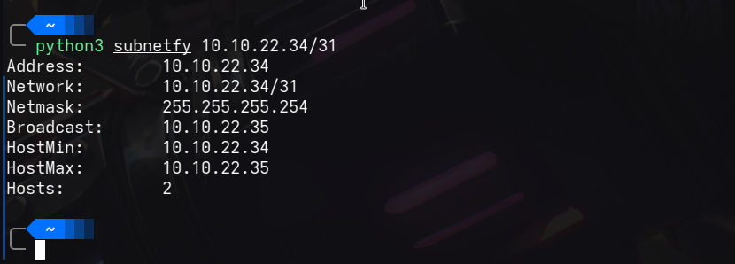

### Subnetfy

This was part of a subneting lab. 

There's a bunch of tools out there that do the same thing. I only did this to learn how to calculate subnets better.

```
python3 subnetfy 10.10.22.34/31 
```


